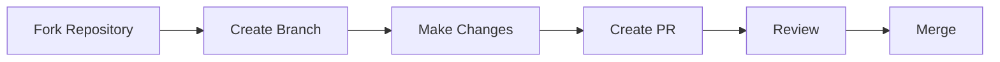

# 🎓 Praktikum Konstruksi Perangkat Lunak

<div align="center">

[](https://docs.microsoft.com/en-us/dotnet/csharp/) [](https://dotnet.microsoft.com/) [](https://visualstudio.microsoft.com/) [](https://git-scm.com/) [](https://github.com/)

</div>

## 📋 Deskripsi

> Repository ini berisi materi dan tugas praktikum untuk mata kuliah **Praktikum Konstruksi Perangkat Lunak**. Fokus utama praktikum ini adalah pengembangan keterampilan dalam membangun perangkat lunak yang berkualitas, dengan penekanan pada best practices, design patterns, dan prinsip-prinsip pengembangan modern.

## 🗂️ Struktur Repository

### 📚 Modul Pembelajaran

<details>
<summary>🌟 Fundamental & Basic Programming</summary>

1. **01_Pengantar_Praktikum_KPL**

   - 🎯 Pengenalan mata kuliah
   - 🛠️ Setup lingkungan pengembangan
   - 📑 Overview materi semester

2. **02_Pengenalan_IDE_dan_Pemrograman_CSharp**

   - 💻 Dasar-dasar Visual Studio
   - 📝 Fundamental C#
   - ✨ Best practices coding

3. **03_GUI_Builder_dan_GitHub**
   - 🖥️ Windows Forms dan WPF
   - 🔄 Version control dengan Git
   - 👥 Collaborative development
   </details>

<details>
<summary>🔧 Advanced Programming Concepts</summary>

4. **04_Automata_dan_Table-Driven_Construction**

   - 🔄 Finite State Automata
   - 📊 Table-driven programming
   - 🎯 Pattern matching

5. **05_Generics**

   - 📦 Generic programming
   - 🛡️ Type safety
   - 📚 Collection frameworks

6. **06_Design_by_Contract_dan_Defensive_Programming**
   - ✍️ Contract programming
   - ⚠️ Error handling
   - 🛡️ Robust code development
   </details>

<details>
<summary>🏗️ Software Construction & Design</summary>

7. **07_Grammar-Based_Input_Processing_Parsing**

   - 📝 Parsing techniques
   - 🔍 Grammar implementation
   - ⚡ Input processing

8. **08_Runtime_Configuration_dan_Internationalization**

   - ⚙️ Dynamic configuration
   - 🌐 Localization
   - 🗣️ Multi-language support

9. **09_API_Design_dan_Construction_Using_Swagger**
   - 🔌 RESTful API design
   - 📚 API documentation
   - 🔍 Swagger/OpenAPI
   </details>

<details>
<summary>🚀 Advanced Software Engineering</summary>

10. **10_Library_Construction**

    - 📦 Package development
    - ♻️ Reusable components
    - 🚀 Distribution management

11. **12_Performance_Analysis_Unit_Testing_dan_Debugging**

    - ⚡ Performance optimization
    - 🧪 Test-driven development
    - 🐛 Debugging techniques

12. **13_Design_Pattern_Implementation**

    - 🏗️ Creational patterns
    - 🔧 Structural patterns
    - 🔄 Behavioral patterns

13. **14_Clean_Code** - ✨ Code quality - 🎯 SOLID principles - 🔄 Refactoring
</details>

<details>
<summary>📊 Project Assessment</summary>

14. **15_Review_Tugas_Besar**

    - 📋 Project review
    - 🔍 Code analysis
    - 📚 Documentation review

15. **16_Presentasi_Tugas_Besar** - 🎯 Project presentation - 💻 Technical demonstration - 📊 Final evaluation
</details>

## 📁 Struktur Folder Praktikum

Setiap modul praktikum memiliki struktur yang konsisten:

```
ModulXX/
├── 📁 TP (Tugas Pendahuluan)/
│   ├── 📝 Persiapan
│   ├── 💻 Latihan
│   └── ❓ Quiz
└── 📁 Jurnal/
    ├── 💡 Implementasi
    ├── 📊 Dokumentasi
    └── ✅ Submission
```

## 🛠️ Tools dan Teknologi

### Development Environment

| Category  | Tools & Versions                                                                                                                                                                   |
| --------- | ---------------------------------------------------------------------------------------------------------------------------------------------------------------------------------- |
| IDE       |   |
| Framework |                                         |
| Language  |                                                                                                                    |

### Version Control & Collaboration

| Category        | Tools & Versions                                                               |
| --------------- | ------------------------------------------------------------------------------ |
| Version Control |                 |
| Repository      |         |
| Code Review     |  |

### Testing & Quality

| Category            | Tools & Versions                                                                                                                              |
| ------------------- | --------------------------------------------------------------------------------------------------------------------------------------------- |
| Unit Testing        |   |
| Code Coverage       |                                                                                |
| Performance Testing |                                                                          |

### Documentation & Design

| Category          | Tools & Versions                                                                 |
| ----------------- | -------------------------------------------------------------------------------- |
| API Documentation |           |
| UML Design        |  |
| Documentation     |     |

### Development Tools

| Category           | Tools & Versions                                                                           |
| ------------------ | ------------------------------------------------------------------------------------------ |
| Package Management |                         |
| Code Analysis      |             |
| Code Formatting    |  |

### Deployment & CI/CD

| Category         | Tools & Versions                                                                                 |
| ---------------- | ------------------------------------------------------------------------------------------------ |
| Containerization |                            |
| CI/CD            |  |
| Cloud Platform   |                     |

### Additional Tools

| Category    | Tools & Versions                                                                            |
| ----------- | ------------------------------------------------------------------------------------------- |
| Database    |  |
| API Testing |                  |
| UI Design   |                        |

## 📝 Cara Penggunaan

1. Clone repository:

```bash
git clone https://github.com/username/praktikum-kpl.git
```

2. Buka folder pertemuan yang sesuai
3. Baca `README.md` di setiap folder
4. Kerjakan TP sebelum praktikum
5. Ikuti instruksi dalam folder Jurnal

## 📚 Referensi Utama

| No  | Buku                  | Penulis          |
| --- | --------------------- | ---------------- |
| 1   | Clean Code            | Robert C. Martin |
| 2   | Design Patterns       | Gang of Four     |
| 3   | C# Programming Guide  | Microsoft        |
| 4   | Software Construction | Course Team      |

## 🤝 Kontribusi



---

<div align="center">
Made with ❤️ for Software Engineering Students
</div>
